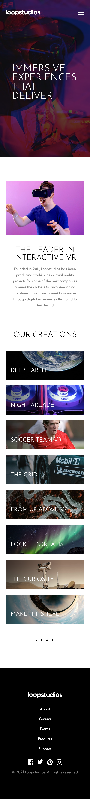

# Frontend Mentor - Loopstudios landing page solution

This is a solution to the [Loopstudios landing page challenge on Frontend Mentor](https://www.frontendmentor.io/challenges/loopstudios-landing-page-N88J5Onjw). Frontend Mentor challenges help you improve your coding skills by building realistic projects.

## Table of contents

- [Overview](#overview)
  - [The challenge](#the-challenge)
  - [Screenshots](#screenshots)
  - [Links](#links)
- [My process](#my-process)
  - [Built with](#built-with)
  - [What I learned](#what-i-learned)
  - [Continued development](#continued-development)
  - [Useful resources](#useful-resources)
- [Author](#author)

## Overview

### The challenge

Users should be able to:

- View the optimal layout for the site depending on their device's screen size
- See hover states for all interactive elements on the page

### Screenshots

|               Mobile designed at 375px:               | Desktop designed at 1440px:                            |
| :---------------------------------------------------: | ------------------------------------------------------ |
|               |               |
|                Mobile (hover states):                 | Desktop (hover states):                                |
|  |  |

### Links

- Solution URL: [https://github.com/elisilk/loopstudios-landing-page](https://github.com/elisilk/loopstudios-landing-page)
- Live Site URL: [https://elisilk.github.io/loopstudios-landing-page/](https://elisilk.github.io/loopstudios-landing-page/)

## My process

### Built with

- Semantic HTML5 markup
- CSS custom properties
- Flexbox
- CSS Grid
- Mobile-first workflow
- Fluid typography and spacing
- Accessibility
- CUBE CSS
- SASS

### What I learned

So many cool 😎 things:

- 
- 
- Fluid typography
  - [An accessible fluid type generator](https://fluid.style/type?min=2.25&max=4.5&min-bp=20&max-bp=77.5&unit=%22rem%22)
  - [Responsive Type and Zoom](https://adrianroselli.com/2019/12/responsive-type-and-zoom.html)
  - [Linearly Scale font-size with CSS clamp() Based on the Viewport](https://css-tricks.com/linearly-scale-font-size-with-css-clamp-based-on-the-viewport/)
  - [Modern Fluid Typography Using CSS Clamp](https://www.smashingmagazine.com/2022/01/modern-fluid-typography-css-clamp/)
    - [Modern fluid typography editor](https://modern-fluid-typography.vercel.app/)
- Fonts and Line Height
  - [Text Crop tool](https://text-crop.eightshapes.com/?typeface-selection=google-font&typeface=Josefin%20Sans&custom-typeface-name=Helvetica&custom-typeface-url=&custom-typeface-weight=400&custom-typeface-style=normal&weight-and-style=300&size=72&line-height=1&top-crop=2&bottom-crop=18)
    - [Cropping Away Negative Impacts of Line Height](https://medium.com/eightshapes-llc/cropping-away-negative-impacts-of-line-height-84d744e016ce)
    - [Contrast Grid tool](https://contrast-grid.eightshapes.com/?version=1.1.0&background-colors=&foreground-colors=%23FFFFFF%2C%20White%0D%0A%23F2F2F2%0D%0A%23DDDDDD%0D%0A%23CCCCCC%0D%0A%23888888%0D%0A%23404040%2C%20Charcoal%0D%0A%23000000%2C%20Black%0D%0A%232F78C5%2C%20Effective%20on%20Extremes%0D%0A%230F60B6%2C%20Effective%20on%20Lights%0D%0A%23398EEA%2C%20Ineffective%0D%0A&es-color-form__tile-size=compact&es-color-form__show-contrast=aaa&es-color-form__show-contrast=aa&es-color-form__show-contrast=aa18&es-color-form__show-contrast=dnp) - Another very cool tool, unrelated to fonts and line height, but awesome nonetheless.
  - [How to Tame Line Height in CSS](https://css-tricks.com/how-to-tame-line-height-in-css/)
  - [Leading-Trim: The Future of Digital Typesetting](https://medium.com/microsoft-design/leading-trim-the-future-of-digital-typesetting-d082d84b202)
- [Grid template areas](https://developer.mozilla.org/en-US/docs/Web/CSS/grid-template-areas)
  - [Why grid-template-areas are amazing | #shorts](https://youtu.be/sYDQBfSQFRI?si=GWBRt-idYdgoYdMJ)
- Visually-hidden utility class
  - [Comparing Various Ways to Hide Things in CSS](https://css-tricks.com/comparing-various-ways-to-hide-things-in-css/)
  - [The anatomy of visually-hidden](https://www.tpgi.com/the-anatomy-of-visually-hidden/)
  - [CSS in Action: Invisible Content Just for Screen Reader Users](https://webaim.org/techniques/css/invisiblecontent/)
  - [Visually hidden content is a hack that needs to be resolved, not enshrined](https://www.scottohara.me/blog/2023/03/21/visually-hidden-hack.html)
  - [Design vs. accessibility and the CSS visually-hidden class](https://blog.logrocket.com/design-accessibility-css-visually-hidden-class)

### Continued development

Specific areas that the solution should be improved (known issues):

- Turn the header into some sort of sticky header that stays around as the user scrolls down the page (at least in the mobile view)
- Make sure the design works down to 320px viewport width
  - "experiences" in the h1 title goes beyond the containing box

More general ideas I want to consider:

Hmm 🤔 ...

### Useful resources

- [Kevin Powell on YouTube](https://www.youtube.com/@KevinPowell) - He's the best.
- [Accessibility Developer Guide](https://www.accessibility-developer-guide.com/)
- [MDN Web Docs for CSS](https://developer.mozilla.org/en-US/docs/Web/CSS) - Went here a lot to reference the different CSS properties and the shorthands, and all the great explanations about best practices.
- [The Clamp Calculator](https://royalfig.github.io/fluid-typography-calculator/) - Used for all of fluid typography and fluid spacing calculations.

## Author

- Website - [Eli Silk](https://github.com/elisilk)
- Frontend Mentor - [@elisilk](https://www.frontendmentor.io/profile/elisilk)
